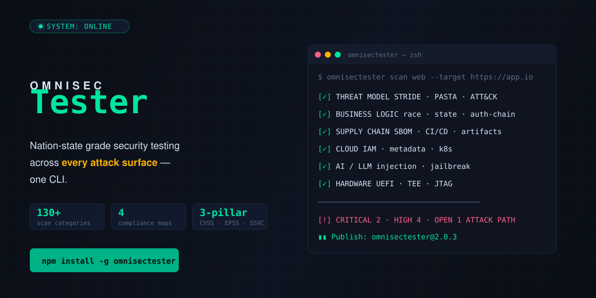

<p align="center">
  <picture>
    <source media="(prefers-color-scheme: dark)" srcset="assets/readme/hero.svg">
    
  </picture>
</p>

<p align="center">
  <a href="https://www.npmjs.com/package/omnisectester"></a>
  <a href="https://github.com/iAMv1/omnisectester"></a>
  <a href="https://opensource.org/licenses/MIT"></a>
  
  
</p>

---

## Why OmniSec Tester?

Every claim below is backed by tests in this repository and verified end-to-end runs.

| Capability | What it actually does |
|---|---|
| **Web agent** | Crawls same-origin pages, discovers params/forms itself, probes reflected XSS (GET+POST) with executable curl PoCs, audits security headers/TLS/cookies/sensitive paths/open redirects — rate-limited, budget-capped |
| **AI/LLM scanning** | Prompt-injection battery (instruction override, roleplay escape, system-prompt extraction, secret fishing) against any OpenAI-compatible chat endpoint |
| **Mobile** | Android APK static analysis: dangerous permissions, debuggable, allowBackup, signature files |
| **Desktop** | Binary metadata checks (PE headers, debug artifacts, signing) |
| **Supply chain** | SBOM generation + OSV.dev vulnerability matching; CI/CD workflow poisoning checks |
| **Cloud** | Offline IaC/config misconfiguration auditing |
| **Post-exploitation** | Evidence-based assessment mapped to MITRE ATT&CK |
| **Auth & business logic** | Login-flow session testing, IDOR pattern probes, rate-limit detection |
| **CVE intelligence** | Live CVSS lookups from NVD |
| **CI/CD native** | JSON + SARIF 2.1.0 output, deterministic exit codes (`--fail-on` → exit 2), `verify-tools --strict` gate |

### Honest limitations (we ship this table, not marketing)

| Not yet built | Status |
|---|---|
| Browser extension scanning | wiring only |
| Firmware / hardware analysis | queued last (owner priority) |
| PDF / JUnit XML / ATT&CK Navigator reports | roadmap |
| EPSS + SSVC scoring pillars, compliance auto-mapping (PCI/NIST/SOC2/ISO) | roadmap |
| Red-team kill-chain simulation | roadmap |
| LLM-powered attack chaining | optional `--llm` layer ships today (bring your own key); deeper chaining roadmap |

---

## Quick start

```bash
# install globally
npm install -g omnisectester        # requires Python >= 3.10 on PATH

# live CVE severity from NVD (no Python needed)
omnisectester severity CVE-2021-44228

# agentic web scan: crawl -> discover -> probe -> PoC -> gate
omnisectester scan web https://your-app.example --fail-on critical

# authenticated scanning behind a login form
omnisectester scan web https://app.example \
  --login-url https://app.example/login --login-data "user=a&pass=b"

# prompt-injection battery against an LLM endpoint
omnisectester scan ai https://your-chat.example --auth-token "$KEY"

# mobile / desktop / supply chain / cloud
omnisectester scan mobile app.apk
omnisectester scan desktop app.exe
omnisectester scan supply-chain .
omnisectester scan cloud ./infra

# SBOM with vulnerability matching
omnisectester sbom . --vulns

# continuous monitoring - reports only NEW findings vs last run
omnisectester continuous --targets https://app.example --fail-on high

# environment audit / CI gate
omnisectester verify-tools --strict
```

Exit codes everywhere: `0` clean · `1` failure · `2` findings met `--fail-on`.

---

## How it works

The engine ([omnisectester-core](https://github.com/iAMv1/omnisectester-core), stdlib-only Python) runs a phased loop — and the threat model runs **before any probing**, then again after with observed-fact relevance:

```
threat model ──► crawl ──► map surface ──► probe ──► validate ──► report
     ▲                                                            │
     └──────────────── re-runs with observed facts ◄──────────────┘
```

Findings are deterministic, severity-sorted, and carry
`{id, title, severity, evidence, remediation, cwe}` — reflection and
redirect findings include an executable curl reproduction.

---

## One CLI, every surface

```bash
omnisectester scan web           https://app.example      # crawling agent
omnisectester scan ai            https://llm.example/chat # prompt injection
omnisectester scan mobile        app.apk                  # static analysis
omnisectester scan desktop       app.exe                  # binary metadata
omnisectester scan supply-chain  .                        # deps + CI/CD checks
omnisectester scan cloud         ./infra                  # IaC/config audit
```

Extension and firmware scanning are roadmap items (see limitations above).

---

## Reporting

| Format | Use case |
|--------|----------|
| **JSON** | machine-readable, CI/CD and ticketing integration |
| **Markdown** | human-readable summary |
| **HTML** | findings with embedded terminal-style PoC blocks |
| **SARIF 2.1.0** | GitHub code scanning / IDE workflow |

Unsupported formats are reported back explicitly — nothing is silently dropped.

---

## Continuous testing

```bash
# one-shot diff across targets: only NEW findings since last run
omnisectester continuous --targets https://a.example,https://b.example \
  --fail-on high

# scheduled (cron/CI calls the same command; state auto-stored)
```

State lives in `~/.omnisectester/continuous-state.json`.

---

## Config

Drop a `omnisectester.yaml` in your project root (schema-validated):

```yaml
version: "2"
engagement:
  mode: gray_box          # automated | gray_box | red_team | purple_team | continuous
  kill_switch: true
testing:
  rate_limit: { requests_per_second: 4 }
reporting:
  formats: [json, html, sarif]
```

---

## CLI reference

```
omnisectester scan <surface>       Agentic platform scan (web/ai/mobile/desktop/supply-chain/cloud)
omnisectester engage <target>      Threat model FIRST + agent scan + reports
omnisectester threat-model <t>     Observation-driven STRIDE model
omnisectester report <input>       Render md/html/json/sarif
omnisectester sbom <dir> --vulns   CycloneDX 1.5 + OSV.dev matching
omnisectester continuous --targets Stateful multi-target monitoring
omnisectester verify-tools         Environment audit (--strict gate, --fix repair)
omnisectester severity <cve>       Live CVSS lookup from NVD
omnisectester list --taxonomy      Category catalog / tools / compliance list
```

Agent-facing docs: [`AGENTS.md`](AGENTS.md) · [`llms.txt`](llms.txt) · install as coding-agent skill: `npx skills add iAMv1/omnisectester`

---

## How to contribute

```bash
npm install
npm test            # CLI suite (15 behavioral subprocess assertions)
cd ../omnisectester-core && python -m unittest discover -s tests -v   # engine suite (33)
```

- Issues: <https://github.com/iAMv1/omnisectester/issues>

---

## License

MIT — see [LICENSE](LICENSE) and [CHANGELOG](CHANGELOG.md).

---

<p align="center">
  <sub>⚠️ Use OmniSec Tester only on systems you own or have written authorization to test. Unauthorized testing is illegal.</sub>
</p>
