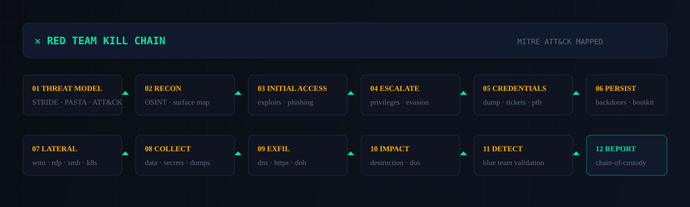
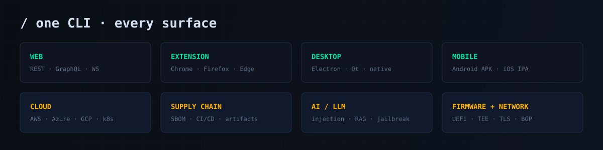
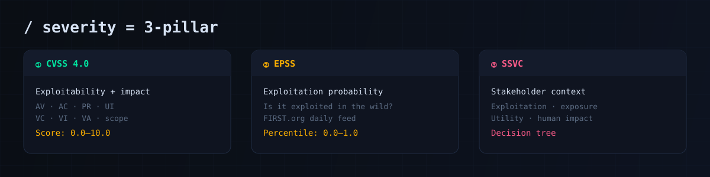
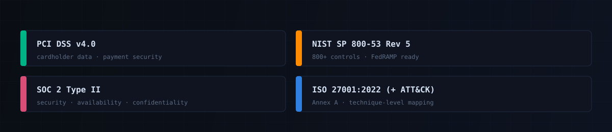

<p align="center">
  <picture>
    <source media="(prefers-color-scheme: dark)" srcset="assets/readme/hero.svg">
    
  </picture>
</p>

<p align="center">
  <a href="https://www.npmjs.com/package/omnisectester"></a>
  <a href="https://github.com/iAMv1/omnisectester"></a>
  <a href="https://opensource.org/licenses/MIT"></a>
  
  
</p>

---

## What is it?

**OmniSec Tester** is a nation-state grade, defense-in-depth security testing framework that simulates the full kill chain of an advanced persistent threat — from reconnaissance to post-exploitation — across **every attack surface**, from a single CLI.

Its thinking is simple: **an attacker does not scan for CVEs. An attacker chains business-logic flaws, supply-chain backdoors, cloud misconfigurations, and weak credentials into one path to your crown jewels.** So instead of a checklist, OmniSec Tester runs an adversary simulation.

> Auth testing is **default-on**. Business logic and supply chain testing are **mandatory**, not opt-in toggles. A documented threat model (STRIDE + PASTA + MITRE ATT&CK) is generated **before any test runs**.

---

## Quick start

```bash
# install globally
npm install -g omnisectester

# verify your environment (Python, tools, core)
omnisectester verify-tools

# run a full engagement
omnisectester engage --target https://app.io --mode gray_box --output reports/

# generate interactive reports
omnisectester report --input reports/scan.json --format html,json,pdf,sarif
```

That's it — one command runs threat modeling, business logic, supply chain, cloud, AI/LLM, memory, and post-exploitation tests, then publishes a compliance-mapped report set.

---

## How it works

OmniSec Tester executes a **12-phase kill chain**, mapped to MITRE ATT&CK at every step. This is an adversary simulation, not a scanner:

<p align="center">
  
</p>

Each phase is traceable end-to-end: findings carry their **MITRE ATT&CK technique**, the **attack path** they open, and the **compliance controls** they breach.

---

## One CLI, every surface

<p align="center">
  
</p>

```bash
omnisectester scan web          --target https://app.io
omnisectester scan extension    --target addon.crx --platform chrome
omnisectester scan desktop      --target app.exe --platform windows
omnisectester scan mobile       --target app.apk --android
omnisectester scan cloud        --target aws --profile production
omnisectester scan supply-chain --target .
omnisectester scan ai           --target https://llm.app.io/chat
omnisectester scan firmware     --target firmware.bin
```

---

## Severity you can trust

No inflated "CRITICAL" labels. Every finding is scored through **three pillars** — the CVSS 4.0 score, the real-world EPSS exploitation probability, and a stakeholder-specific SSVC decision:

<p align="center">
  
</p>

Only a handful of categories ever default to CRITICAL; everything else must clear an **EPSS > 0.8** exploitability bar. You get a prioritization list that reflects what attackers are **actually** doing.

---

## Compliance mapped automatically

Every finding maps to the compliance controls you care about, so the report doubles as an audit artifact:

<p align="center">
  
</p>

---

## What it covers

| Domain | Coverage |
|--------|----------|
| **Application** | Web, REST/GraphQL/WebSocket APIs, browser extensions, Electron/Qt/native desktop, Android/iOS mobile |
| **Business logic** | Race conditions, state-machine manipulation, workflow bypass, financial flows, multi-tenant isolation, DeFi reentrancy |
| **Supply chain** | SBOM generation, dependency confusion / typosquatting, CI/CD pipeline poisoning, artifact & signing verification |
| **Cloud & infra** | AWS / Azure / GCP IAM, metadata-service SSRF, container escape, Kubernetes RBAC, serverless |
| **AI / LLM** | Prompt injection, jailbreaks, RAG poisoning, model inversion, adversarial examples |
| **Memory safety** | Use-after-free, heap manipulation, JIT exploitation, kernel fuzzing (AFL++, LibAFL, Jazzer, Nyx, OneFuzz) |
| **Hardware / firmware** | UEFI/BIOS, TEE (TrustZone, SGX, SEV), JTAG/UART, cache & power side channels |
| **Post-exploitation** | Credential dumping, Kerberos / pass-the-hash, lateral movement, persistence, EDR/AMSI evasion, exfiltration |
| **Network** | TLS 1.3/QUIC, DNS-over-HTTPS, BGP, HTTP/2, WebSocket, TLS & crypto implementation |

---

## Reporting

| Format | Use case |
|--------|----------|
| **HTML** | Interactive report with attack-path graphs and compliance traffic lights |
| **JSON** | Machine-readable, CI/CD and ticketing integration |
| **PDF** | Executive / regulator-ready |
| **SARIF** | IDE and developer workflow |
| **JUnit XML** | Pipeline gates |
| **ATT&CK Navigator** | Technique coverage matrix |

All evidence is **SHA-256 hashed** with a chain-of-custody manifest and NTP-synchronized timestamps.

---

## Continuous testing

Plug security testing into your pipeline, not just an annual exercise:

```bash
# shift-left on every commit / PR
omnisectester ci-scan --config ci-config.yaml --fail-on critical,high

# scheduled scans
omnisectester continuous --config continuous.yaml --schedule "0 2 * * *"
```

Daily EPSS feeds, CISA KEV, and ATT&CK technique updates re-prioritize findings automatically.

---

## Config

Drop a `omnisectester.yaml` in your project root:

```yaml
engagement:
  mode: gray_box          # automated | gray_box | red_team | purple_team | continuous
  authorization: "AUTH-REF"
  kill_switch: true
threat_model:
  frameworks: [STRIDE, PASTA, ATTACK]
  adversary_profiles: [APT29, APT41]
testing:
  authentication: true    # MANDATORY - default on
  business_logic: true    # MANDATORY
  supply_chain: true
  cloud_security: true
  rate_limit: { requests_per_second: 1 }
reporting:
  formats: [json, html, pdf, sarif]
  compliance_frameworks: [pci_dss, nist_800_53, soc2, iso27001]
```

---

## CLI reference

```
omnisectester engage <target>      Full engagement (all phases)
omnisectester scan    <surface>    Platform-specific scan
omnisectester threat-model <url>   Generate threat model (Step 0)
omnisectester redteam <target>     Kill-chain simulation
omnisectester report <input>       Generate report set
omnisectester sbom <path>          Generate SBOM
omnisectester continuous           CI/CD integration
omnisectester verify-tools         Check environment
omnisectester severity <cve>       CVSS 4.0 + EPSS lookup
omnisectester list --taxonomy      List 130+ test categories
```

---

## How to contribute

```bash
npm install
npm test
npm run lint
npm link          # use omnisectester from a local checkout
```

- Issues: <https://github.com/iAMv1/omnisectester/issues>
- Docs: <https://omnisectester.io/docs>

---

## License

MIT — see [LICENSE](LICENSE) and [CHANGELOG](CHANGELOG.md).

---

<p align="center">
  <sub>⚠️ Use OmniSec Tester only on systems you own or have written authorization to test. Unauthorized testing is illegal.</sub>
</p>

